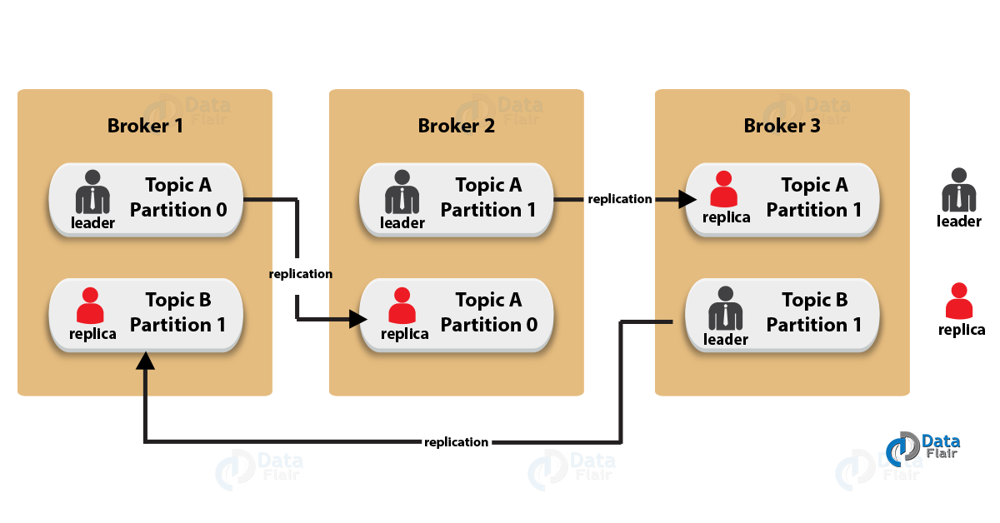

## Kafka Interview Preparation Grid


<details>
<summary><b>Kafka Architecture – Apache Kafka APIs</b></summary>
Apache Kafka Architecture has four core APIs, producer API, Consumer API, Streams API, and Connector API. Let’s discuss them one by one:


a. Producer API
In order to publish a stream of records to one or more Kafka topics, the Producer API allows an application.

b. Consumer API
This API permits an application to subscribe to one or more topics and also to process the stream of records produced to them.

c. Streams API
Moreover, to act as a stream processor, consuming an input stream from one or more topics and producing an output stream to one or more output topics, effectively transforming the input streams to output streams, the streams API permits an application.

d. Connector API
While it comes to building and running reusable producers or consumers that connect Kafka topics to existing applications or data systems, we use the Connector API. For example, a connector to a relational database might capture every change to a table.
</details>

<details>
<summary><b>Kafka Architecture – Cluster</b></summary>


Let’s describe each component of Kafka Architecture shown in the above diagram:

a. <b>Kafka Broker</b> Basically, to maintain load balance Kafka cluster typically consists of multiple brokers. However, these are stateless, hence for maintaining the cluster state they use ZooKeeper. Although, one Kafka Broker instance can handle hundreds of thousands of reads and writes per second.

Whereas, without performance impact, each broker can handle TB of messages. In addition, make sure ZooKeeper performs Kafka broker leader election.

b. Kafka – ZooKeeper
For the purpose of managing and coordinating, Kafka broker uses ZooKeeper. Also, uses it to notify producer and consumer about the presence of any new broker in the Kafka system or failure of the broker in the Kafka system.

As soon as Zookeeper send the notification regarding presence or failure of the broker then producer and consumer, take the decision and starts coordinating their task with some other broker.

c. Kafka Producers
Further, Producers in Kafka push data to brokers. Also, all the producers search it and automatically sends a message to that new broker, exactly when the new broker starts.

However, keep in mind that the Kafka producer sends messages as fast as the broker can handle, it doesn’t wait for acknowledgments from the broker.

d. Kafka Consumers
Basically, by using partition offset the Kafka Consumer maintains that how many messages have been consumed because Kafka brokers are stateless. Moreover, you can assure that the consumer has consumed all prior messages once the consumer acknowledges a particular message offset.

Also, in order to have a buffer of bytes ready to consume, the consumer issues an asynchronous pull request to the broker. Then simply by supplying an offset value, consumers can rewind or skip to any point in a partition. In addition, ZooKeeper notifies Consumer offset value.

</details>

<details>
<summary><b>Kafka Architecture – Fundamental Concepts</b></summary>
Here, we are listing some of the fundamental concepts of Kafka Architecture that you must know:
<b>a. Kafka Topics</b>
The topic is a logical channel to which producers publish message and from which the consumers receive messages.

1. A topic defines the stream of a particular type/classification of data, in Kafka. 
2. Moreover, here messages are structured or organized. A particular type of messages is published on a particular topic. 
3. Basically, at first, a producer writes its messages to the topics. Then consumers read those messages from topics. 
4. In a Kafka cluster, a topic is identified by its name and must be unique. 
5. There can be any number of topics, there is no limitation. 
6. We can not change or update data, as soon as it gets published.

Below is the image which shows the relationship between Kafka Topics and Partitions:


<b>b. Partitions in Kafka</b>
In a Kafka cluster, Topics are split into Partitions and also replicated across brokers.

1. However, to which partition a published message will be written, there is no guarantee about that. 
2. Also, we can add a key to a message. Basically, we will get ensured that all these messages (with the same key) will end up in the same partition if a producer publishes a message with a key. Due to this feature, Kafka offers message sequencing guarantee. Though, unless a key is added to it, data is written to partitions randomly. 
3. Moreover, in one partition, messages are stored in the sequenced fashion. 
4. In a partition, each message is assigned an incremental id, also called offset. 
5. However, only within the partition, these offsets are meaningful. Moreover, in a topic, it does not have any value across partitions. 
6. There can be any number of Partitions, there is no limitation.

<b>c. Topic Replication Factor in Kafka</b>
While designing a Kafka system, it’s always a wise decision to factor in topic replication. As a result, its topics’ replicas from another broker can solve the crisis, if a broker goes down. For example, we have 3 brokers and 3 topics.

Broker1 has Topic 1 and Partition 0, its replica is in Broker2, so on and so forth. It has got a replication factor of 2; it means it will have one additional copy other than the primary one. Below is the image of Topic Replication Factor:

Some key points –

1. Replication takes place in the partition level only. 
2. For a given partition, only one broker can be a leader, at a time. Meanwhile, other brokers will have in-sync replica; what we call ISR. 
3. It is not possible to have the number of replication factor more than the number of available brokers.

<b>d. Consumer Group</b>
1. It can have multiple consumer process/instance running. 
2. Basically, one consumer group will have one unique group-id. 
3. Moreover, exactly one consumer instance reads the data from one partition in one consumer group, at the time of reading. 
4. Since, there is more than one consumer group, in that case, one instance from each of these groups can read from one single partition. 
5. However, there will be some inactive consumers, if the number of consumers exceeds the number of partitions. Let’s understand it with an example if there are 8 consumers and 6 partitions in a single consumer group, that means there will be 2 inactive consumers.

So, this was all about Apache Kafka Architecture. Hope you like our explanation.

</details>

### Medium Interview Questions :
<details>
<summary><b>1. What is Apache Kafka and why is it used?</b></summary>
Apache Kafka is a distributed streaming platform used for building real-time data pipelines and streaming applications.Apache Kafka is a publish-subscribe open source message broker application. This messaging application was coded in “Scala”. Basically, this project was started by the Apache software. Kafka’s design pattern is mainly based on the transactional logs design.
</details>

<details>
<summary><b>2. How does Kafka differ from traditional messaging systems?</b></summary>
Kafka is designed for fault tolerance, high throughput, and scalability, unlike traditional messaging systems that may not handle large data streams efficiently.
</details>

<details>
<summary><b>3. What are Producers and Consumers in Kafka?</b></summary>
   Producers publish messages to Kafka topics. Consumers read messages from topics.

```
// Producer
producer.send(new ProducerRecord<String, String>("topic", "key", "value"));
// Consumer
consumer.subscribe(Arrays.asList("topic"));
```

</details>

<details>
<summary><b>4. What is a Kafka Topic?</b></summary>
   A Topic is a category to which records are published by producers and from which records are consumed by consumers.

```
kafka-topics.sh --create --topic my_topic --bootstrap-server localhost:90
```
</details>

<details>
<summary><b>5. How does Kafka ensure durability and fault-tolerance?</b></summary>
   Kafka replicates data across multiple brokers. Consumers read from leader replicas, and follower replicas synchronize data.
</details>

<details>
<summary><b>6. What is a Kafka Partition?</b></summary>
   Partitions allow Kafka to horizontally scale as each partition can be hosted on a different server.
</details>

<details>
<summary><b>7. What is Zookeeper’s role in a Kafka ecosystem?</b></summary>
   Zookeeper manages brokers, maintains metadata, and helps in leader election for partitions.
</details>

<details>
<summary><b>8. How can you secure Kafka?</b></summary>
   Kafka can be secured using SSL for encryption, SASL(Simple Authentication and Security Layer) for authentication, and ACLs(Access Control Lists) for authorization.
</details>

<details>
<summary><b>9. What is Kafka Streams?</b></summary>
   Kafka Streams is a client library for building real-time, highly scalable, fault-tolerant stream processing applications.

```
KStream<String, String> stream = builder.stream(“input-topic”);
stream.to(“output-topic”);
```
</details>

<details>
<summary><b>10. What are some use-cases for Kafka?</b></summary>
    Kafka is used for real-time analytics, data lakes, aggregating data from different sources, and acting as a buffer to handle burst data loads.
</details>

<details>
<summary><b>11. How do you integrate Kafka with Spring Boot?</b></summary>
    You can use the Spring Kafka library, which provides `@KafkaListener` for consumers and `KafkaTemplate` for producers.
```
@KafkaListener(topics = “myTopic”)
public void listen(String message) {
// Handle message
}
```
</details>

<details>
<summary><b>12. How do you send a message to a Kafka topic using Spring Kafka?</b></summary>
    Use `KafkaTemplate` to send messages.
```
kafkaTemplate.send("myTopic", "myMessage");
```
</details>

<details>
<summary><b>13. How do you consume messages from a Kafka topic in Spring?</b></summary>
    Use the `@KafkaListener` annotation to mark a method as a Kafka message consumer.
```
@KafkaListener(topics = “myTopic”)
public void consume(String message) {
// Process message
}
```
</details>

<details>
<summary><b>14. How do you handle message deserialization errors in Spring Kafka?</b></summary>
    Use the `ErrorHandlingDeserializer` to wrap the actual deserializer and catch deserialization errors.
</details>

<details>
<summary><b>15. How do you ensure ordered message processing in Spring Kafka?</b></summary>
    Set the `concurrency` property of `@KafkaListener` to 1 to ensure single-threaded consumption for each partition.

```
@KafkaListener(topics = “myTopic”, concurrency = “1”)
```
</details>

<details>
<summary><b>16. How do you batch-process messages from Kafka in Spring?</b></summary>
    Use the `@KafkaListener` annotation with the `batchListener` property set to `true`.

```
@KafkaListener(topics = “myTopic”, batchListener = true)
public void consume(List<det> messages) {
// Process messages
}
```
</details>

<details>
<summary><b>17. How do you filter messages in Spring Kafka?</b></summary>
    Implement a `RecordFilterStrategy` to filter out unwanted records before they reach the `@KafkaListener`.

Create a class that implements RecordFilterStrategy:
```
import org.apache.kafka.clients.consumer.ConsumerRecord;
import org.springframework.kafka.listener.adapter.RecordFilterStrategy;

public class MyRecordFilterStrategy implements RecordFilterStrategy<String, String> {

    @Override
    public boolean filter(ConsumerRecord<String, String> consumerRecord) {
        // Return true to filter out the record, false to include it
        return !consumerRecord.value().contains("important");
    }
}
```
Now, configure your ConcurrentKafkaListenerContainerFactory to use this filter:
```
import org.springframework.context.annotation.Bean;
import org.springframework.context.annotation.Configuration;
import org.springframework.kafka.config.ConcurrentKafkaListenerContainerFactory;
import org.springframework.kafka.core.ConsumerFactory;

@Configuration
public class KafkaConsumerConfig {

    @Bean
    public ConcurrentKafkaListenerContainerFactory<String, String> kafkaListenerContainerFactory(
            ConsumerFactory<String, String> consumerFactory) {
        ConcurrentKafkaListenerContainerFactory<String, String> factory = new ConcurrentKafkaListenerContainerFactory<>();
        factory.setConsumerFactory(consumerFactory);
        factory.setRecordFilterStrategy(new MyRecordFilterStrategy());
        return factory;
    }
}
```
Finally, use the @KafkaListener annotation to consume messages:
```
import org.springframework.kafka.annotation.KafkaListener;
import org.springframework.stereotype.Service;

@Service
public class MyKafkaConsumer {

    @KafkaListener(topics = "myTopic")
    public void consume(String message) {
        System.out.println("Consumed message: " + message);
    }
}
```
</details>

<details>
<summary><b>18. How do you handle retries for message processing in Spring Kafka?</b></summary>
    Configure a `SeekToCurrentErrorHandler` or implement a custom error handler to manage retries.
</details>

<details>
<summary><b>19. How can you produce and consume Avro messages in Spring Kafka?</b></summary>
    Use the Apache Avro serializer and deserializer along with Spring Kafka’s `KafkaTemplate` and `@KafkaListener`.

</details>

<details>
<summary><b>20. How do you secure Kafka communication in a Spring application?</b></summary>
    Configure SSL properties in the `application.yml` or `application.properties` file for secure communication.
```
spring.kafka.properties.security.protocol: SSL
```
</details>

<details>
<summary><b>21. What are the key differences between Spring AMQP and Spring Pub-Sub?</b></summary>
   Spring AMQP is based on the AMQP protocol and is often used with RabbitMQ. It supports complex routing and is suitable for enterprise-level applications. Spring Pub-Sub is generally used with messaging systems like Kafka and is more geared towards high-throughput data streaming.
</details>

<details>
<summary><b>22. How do message delivery semantics differ between Spring AMQP and Spring Pub-Sub?</b></summary>
    Spring AMQP provides more granular control over message acknowledgment and transactions. Spring Pub-Sub, especially with Kafka, focuses on high-throughput and allows at-least-once, at-most-once, and exactly-once semantics.

Configure the producer for exactly-once semantics by setting the transactional.id and acks properties:
```
import org.apache.kafka.clients.producer.KafkaProducer;
import org.apache.kafka.clients.producer.Producer;
import org.apache.kafka.clients.producer.ProducerConfig;
import org.apache.kafka.clients.producer.ProducerRecord;

import java.util.Properties;

public class ExactlyOnceProducer {
public static void main(String[] args) {
Properties props = new Properties();
props.put(ProducerConfig.BOOTSTRAP_SERVERS_CONFIG, "localhost:9092");
props.put(ProducerConfig.KEY_SERIALIZER_CLASS_CONFIG, "org.apache.kafka.common.serialization.StringSerializer");
props.put(ProducerConfig.VALUE_SERIALIZER_CLASS_CONFIG, "org.apache.kafka.common.serialization.StringSerializer");
props.put(ProducerConfig.TRANSACTIONAL_ID_CONFIG, "my-transactional-id");
props.put(ProducerConfig.ACKS_CONFIG, "all");

        Producer<String, String> producer = new KafkaProducer<>(props);
        producer.initTransactions();

        try {
            producer.beginTransaction();
            for (int i = 0; i < 100; i++) {
                producer.send(new ProducerRecord<>("my-topic", Integer.toString(i), Integer.toString(i)));
            }
            producer.commitTransaction();
        } catch (Exception e) {
            producer.abortTransaction();
        }
        producer.close();
    }
}
```
Configure the consumer to read committed messages:
```
import org.apache.kafka.clients.consumer.Consumer;
import org.apache.kafka.clients.consumer.ConsumerConfig;
import org.apache.kafka.clients.consumer.ConsumerRecords;
import org.apache.kafka.clients.consumer.KafkaConsumer;

import java.time.Duration;
import java.util.Collections;
import java.util.Properties;

public class ExactlyOnceConsumer {
public static void main(String[] args) {
Properties props = new Properties();
props.put(ConsumerConfig.BOOTSTRAP_SERVERS_CONFIG, "localhost:9092");
props.put(ConsumerConfig.GROUP_ID_CONFIG, "my-group");
props.put(ConsumerConfig.KEY_DESERIALIZER_CLASS_CONFIG, "org.apache.kafka.common.serialization.StringDeserializer");
props.put(ConsumerConfig.VALUE_DESERIALIZER_CLASS_CONFIG, "org.apache.kafka.common.serialization.StringDeserializer");
props.put(ConsumerConfig.ISOLATION_LEVEL_CONFIG, "read_committed");

        Consumer<String, String> consumer = new KafkaConsumer<>(props);
        consumer.subscribe(Collections.singletonList("my-topic"));

        while (true) {
            ConsumerRecords<String, String> records = consumer.poll(Duration.ofMillis(100));
            records.forEach(record -> {
                System.out.printf("Consumed record with key %s and value %s%n", record.key(), record.value());
            });
        }
    }
}
```
</details>

<details>
<summary><b>23. How do you handle message ordering in Spring AMQP and Spring Pub-Sub?</b></summary>
    In Spring AMQP, message ordering is generally maintained within a single queue. In Spring Pub-Sub with Kafka, message ordering is maintained within a partition.
</details>

<details>
<summary><b>24. How do you implement dead-letter queues in Spring AMQP and Spring Pub-Sub?</b></summary>
    Spring AMQP has built-in support for dead-letter exchanges and queues. In Spring Pub-Sub with Kafka, you’d typically use a separate topic as a dead-letter queue.

Consumer Configuration
```
@KafkaListener(topics = "my-topic", errorHandler = "myErrorHandler")
public void listen(String message) {
// Process message or throw an exception
}

@Bean
public KafkaTemplate<String, String> kafkaTemplate() {
return new KafkaTemplate<>(producerFactory());
}

@Bean
public ProducerFactory<String, String> producerFactory() {
// Configure producer factory
}

@Bean
public MyErrorHandler myErrorHandler(KafkaTemplate<String, String> template) {
return new MyErrorHandler(template);
}
```
Custom Error Handler
```
public class MyErrorHandler implements ErrorHandler {

    private final KafkaTemplate<String, String> template;

    public MyErrorHandler(KafkaTemplate<String, String> template) {
        this.template = template;
    }

    @Override
    public void handle(Exception thrownException, ConsumerRecord<?, ?> record) {
        template.send("my-dead-letter-topic", record.key().toString(), record.value().toString());
    }
}
```
</details>

<details>
<summary><b>25. How do Spring AMQP and Spring Pub-Sub handle message filtering?</b></summary>
    Spring AMQP supports various routing options including direct, topic, fanout, and headers for message filtering. Spring Pub-Sub with Kafka generally relies on consumer logic for filtering or uses Kafka Streams for more complex scenarios.
</details>


### (Q.1) What is Apache Kafka?
Apache Kafka is a publish-subscribe **open source** message broker application. This messaging application was coded in “Scala”. Basically, this project was started by the Apache software. Kafka’s design pattern is mainly based on the transactional logs design.
For detailed understanding of Kafka, go through,  
[Kafka Tutorial](https://data-flair.training/blogs/apache-kafka-tutorial/).

### (Q.2) Enlist the several components in Kafka.
The most important elements of Kafka are:
* Topic – Kafka Topic is the bunch or a collection of messages.
* Producer – In Kafka, Producers issue communications as well as publishes messages to a Kafka topic.
* Consumer – Kafka Consumers subscribes to a topic(s) and also reads and processes messages from the topic(s).
* Brokers –While it comes to manage storage of messages in the topic(s) we use Kafka Brokers.
  For detailed understanding of Kafka components, go through,  
  [Kafka – Architecture](https://data-flair.training/blogs/kafka-architecture/)

### (Q.3) Explain the role of the offset.
Ans. There is a sequential ID number given to the messages in the partitions what we call, an offset. So, to identify each message in the partition uniquely, we use these offsets.

### Q.4 What is a Consumer Group?

Ans. The concept of Consumer Groups is exclusive to Apache Kafka. Basically, every [Kafka consumer group](https://data-flair.training/blogs/kafka-consumer/) consists of one or more consumers that jointly consume a set of subscribed topics.

### Q.5 What is the role of the ZooKeeper in Kafka?

Ans. Apache Kafka is a distributed system is built to use Zookeeper. Although, Zookeeper’s main role here is to build coordination between different nodes in a cluster. However, we also use Zookeeper to recover from previously committed offset if any node fails because it works as periodically commit offset.

### Q.6 Is it possible to use Kafka without ZooKeeper?

Ans. It is impossible to bypass Zookeeper and connect directly to the Kafka server, so the answer is no. If somehow, ZooKeeper is down, then it is impossible to service any client request.

### Q.7 What do you know about Partition in Kafka?

Ans. In every Kafka broker, there are few partitions available. And, here each partition in Kafka can be either a leader or a replica of a topic.
[https://stackoverflow.com/questions/49054946/kafka-topic-partitions](https://stackoverflow.com/questions/49054946/kafka-topic-partitions)

### Q.8 Why is Kafka technology significant to use?

Ans. There are some advantages of Kafka, which makes it significant to use:
* **High-throughput** :  We do not need any large hardware in Kafka, because it is capable of handling high-velocity and high-volume data. Moreover, it can also support message throughput of thousands of messages per second.
* **Low Latency** : Kafka can easily handle these messages with the very low latency of the range of milliseconds, demanded by most of the new use cases.
* **Fault-Tolerant** : Kafka is resistant to node/machine failure within a cluster.
* **Durability** : As Kafka supports messages replication, so,  messages are never lost. It is one of the reasons behind durability.
* **Scalability** : Kafka can be scaled-out, without incurring any downtime on the fly by adding additional nodes.  
  [Kafka – Pros & Cons](https://data-flair.training/blogs/advantages-and-disadvantages-of-kafka/)

### Q.9 What are main APIs of Kafka?
Ans. Apache Kafka has 4 main APIs:
* Producer API
* Consumer API
* Streams API
* Connector API
### Q.10 What are consumers or users?
Ans. Mainly, Kafka Consumer subscribes to a topic(s), and also reads and processes messages from the topic(s). Moreover, with a consumer group name, Consumers label themselves. In other words, within each subscribing consumer group, each record published to a topic is delivered to one consumer instance. Make sure it is possible that Consumer instances can be in separate processes or on separate machines.
###  Q.11 Explain the concept of Leader and Follower.
Ans. In every partition of Kafka, there is one server which acts as the Leader, and none or more servers plays the role as a Followers.

### Q.12 What ensures load balancing of the server in Kafka?
Ans. As the main role of the Leader is to perform the task of all read and write requests for the partition, whereas Followers passively replicate the leader. Hence, at the time of Leader failing, one of the Followers takeover the role of the Leader. Basically, this entire process ensures load balancing of the servers.

### Q.13 What roles do Replicas and the ISR play?
Ans. Basically, a list of nodes that replicate the log is Replicas. Especially, for a particular partition. However, they are irrespective of whether they play the role of the Leader.
In addition, ISR refers to In-Sync Replicas. On defining ISR, it is a set of message replicas that are synced to the leaders.

### Q.14 Why are Replications critical in Kafka?
Ans. Because of Replication, we can be sure that published messages are not lost and can be consumed in the event of any machine error, program error or frequent software upgrades.

### Q.15 If a Replica stays out of the ISR for a long time, what does it signify?
Ans. Simply, it implies that the Follower cannot fetch data as fast as data accumulated by the Leader.

### Q.16 What is the process for starting a Kafka server?
Ans. It is the very important step to initialize the ZooKeeper server because Kafka uses ZooKeeper.So, the process for starting a Kafka server is:
In order to **start the ZooKeeper server**: `> bin/zookeeper-server-start.sh config/zookeeper.properties`   
Next, to **start the Kafka server**: `> bin/kafka-server-start.sh config/server.properties`

### Q.17 In the Producer, when does QueueFullException occur?

Ans. whenever the Kafka Producer attempts to send messages at a pace that the Broker cannot handle at that time QueueFullException typically occurs. However, to collaboratively handle the increased load, users will need to add enough brokers(servers, nodes), since the Producer doesn’t block.  
[Kafka Broker](https://data-flair.training/blogs/kafka-broker/)

### Q.18 Explain the role of the Kafka Producer API.

Ans. An API which permits an application to publish a stream of records to one or more Kafka topics is what we call Producer API.

### Q.19 What is the main difference between Kafka and Flume?

Ans. The main difference between Kafka and Flume are:
**Types of tool**
*  Apache Kafka– As Kafka is a  general-purpose tool for both multiple producers and consumers.
* Apache Flume– Whereas, Flume is considered as a special-purpose tool for specific applications.

**Replication feature**
* Apache Kafka– Kafka can replicate the events.
* Apache Flume- whereas,
  Flume does not replicate the events.

### Q.20 Is Apache Kafka is a distributed streaming platform? if yes, what you can do with it?

Ans. Undoubtedly, Kafka is a streaming platform. It can help: **To push records easily**.
Also, can store a lot of records without giving any storage problems
Moreover, it can process the records as they come in
### Q. 21 What can you do with Kafka?
Ans. It can perform in several ways, such as:
* In order to transmit data between two systems, we can build a real-time stream of data pipelines with it.
* Also, we can build a real-time streaming platform with Kafka, that can actually react to the data.

### Q.22 What is the purpose of retention period in Kafka cluster?
Ans. However, retention period retains all the published records within the Kafka cluster. It doesn’t check whether they have been consumed or not. Moreover, the records can be discarded by using a configuration setting for the retention period. And, it results as it can free up some space.

### Q.23 Explain the maximum size of a message that can be received by the Kafka?
Ans. The maximum size of a message that can be received by the Kafka is approx. 1000000 bytes.

### Q.24 What are the types of traditional method of message transfer?
Ans. Basically, there are two methods of the traditional message transfer method, such as:
* **Queuing**: It is a method in which a pool of consumers may read a message from the server and each message goes to one of them.
* **Publish-Subscribe**: Whereas in Publish-Subscribe, messages are broadcasted to all consumers.
### Q.25 What does ISR stand in Kafka environment?
Ans. ISR refers to In sync replicas. These are generally classified as a set of message replicas which are synced to be leaders.

### Q.26 What is Geo-Replication in Kafka?
Ans. For our cluster, Kafka MirrorMaker offers geo-replication. Basically, messages are replicated across multiple data centers or cloud regions, with MirrorMaker. So, it can be used in active/passive scenarios for backup and recovery; or also to place data closer to our users, or support data locality requirements.

### Q.27 Explain Multi-tenancy?
Ans. We can easily deploy Kafka as a multi-tenant solution. However, by configuring which topics can produce or consume data, Multi-tenancy is enabled. Also, it provides operations support for quotas.  
[https://softwareengineering.stackexchange.com/questions/351524/what-exactly-is-a-multi-tenant-application](https://softwareengineering.stackexchange.com/questions/351524/what-exactly-is-a-multi-tenant-application)
### Q.28 What is the role of Consumer API?
Ans. An API which permits an application to subscribe to one or more topics and also to process the stream of records produced to them is what we call Consumer API.

### Q.29 Explain the role of Streams API?
Ans. An API which permits an application to act as a stream processor, and also consuming an input stream from one or more topics and producing an output stream to one or more output topics, moreover, transforming the input streams to output streams effectively, is what we call Streams API.

### Q.30 What is the role of Connector API?
Ans. An API which permits to run as well as build the reusable producers or consumers which connect Kafka topics to existing applications or data systems is what we call the Connector API.
### Q.31 Explain Producer?
Ans. The main role of Producers is to publish data to the topics of their choice. Basically, its duty is to select the record to assign to partition within the topic.

### Q.32 Compare: RabbitMQ vs Apache Kafka
Ans. One of the Apache Kafka’s alternative is RabbitMQ. So, let’s compare both:
* Features
   * Apache Kafka– Kafka is distributed, durable and highly available, here the data is shared as well as replicated.
   * RabbitMQ– There are no such features in RabbitMQ.
* Performance rate
   * Apache Kafka– To the tune of 100,000 messages/second.
   * RabbitMQ- In case of RabbitMQ, the performance rate is around 20,000 messages/second.

### Q.33 Compare: Traditional queuing systems vs Apache Kafka
Ans. Let’s compare Traditional queuing systems vs Apache Kafka feature-wise:
**Messages Retaining**
* **Traditional queuing systems**– It deletes the messages just after processing completion typically from the end of the queue.
* **Apache Kafka**– But in Kafka, messages persist even after being processed. That implies messages in Kafka don’t get removed as consumers receive them.
  **Logic-based processing**
* **Traditional queuing systems**–Traditional queuing systems don’t permit to process logic based on similar messages or events.
* **Apache Kafka**– Kafka permits to process logic based on similar messages or events.

### Q.34 Why Should we use Apache Kafka Cluster?
Ans. In order to overcome the challenges of collecting the large volume of data, and analyzing the collected data we need a messaging system. Hence Apache Kafka came in the story. Its benefits are:
* It is possible to track web activities just by storing/sending the events for real-time processes.
* Through this, we can Alert as well as report the operational metrics.
* Also, we can transform data into the standard format.
  *Moreover, it allows continuous processing of streaming data to the topics.
* Due to its this wide use, it is ruling over some of the most popular applications like ActiveMQ, RabbitMQ, AWS etc.

### Q.35 Explain the term “Log Anatomy”.
Ans. We view log as the partitions. Basically, a data source writes messages to the log. One of the advantages is, at any time one or more consumers read from the log they select.

### Q.36 What is Data Log in Kafka?
Ans. As we know, messages are retained for a considerable amount of time in Kafka. Moreover, there is flexibility for consumers that they can read as per their convenience. Although, there is a possible case that if Kafka is configured to keep messages for 24 hours and possibly that time consumer is down for time greater than 24 hours, then the consumer may lose those messages. However, still, we can read those messages from last known offset, but only at a condition that the downtime on part of the consumer is just 60 minutes. Moreover, on what consumers are reading from a topic Kafka doesn’t keep state.

### Q.37 Explain how to Tune Kafka for Optimal Performance.
Ans. So, ways to tune Apache Kafka it is to tune its several components:
* Tuning Kafka Producers
* Kafka Brokers Tuning
* Tuning Kafka Consumers
  [Ways for Kafka Optimization](https://data-flair.training/blogs/kafka-performance-tuning/)

### Q.38 State Disadvantages of Apache Kafka.
Ans. Limitations of Kafka are:
* No Complete Set of Monitoring Tools
* Issues with Message Tweaking
* Not support wildcard topic selection
* Lack of Pace    
  [Kafka – Pros & Cons](https://data-flair.training/blogs/advantages-and-disadvantages-of-kafka/)

### Q.39 Enlist all Apache Kafka Operations.
Ans. Apache Kafka Operations are:
- Addition and Deletion of Kafka Topics
- How to modify the Kafka Topics
- Distinguished Turnoff
- Mirroring Data between Kafka Clusters
- Finding the position of the Consumer
- Expanding Your Kafka Cluster
- Migration of Data Automatically
- Retiring Servers
- Datacenters
  [Kafka – Operations](https://data-flair.training/blogs/kafka-operations/)

### Q.40 Explain Apache Kafka Use Cases?
Ans. Apache Kafka has so many use cases, such as:
* **Kafka Metrics**
  It is possible to use Kafka for operational monitoring data. Also, to produce centralized feeds of operational data, it involves aggregating statistics from distributed applications.
* **Kafka Log Aggregation**
  Moreover, to gather logs from multiple services across an organization.
* **Stream Processing**
  While stream processing, Kafka’s strong durability is very useful.
### Q.41 Some of the most notable applications of Kafka.
Ans. Some of the real-time applications are:
* Netflix
* Mozilla
* Oracle  
  [Kafka – Applications](https://data-flair.training/blogs/kafka-use-cases-and-applications/)
### Q.42 Features of Kafka Stream.
Ans. Some best features of Kafka Stream are
* Kafka Streams are highly scalable and fault-tolerant.
* Kafka deploys to containers, VMs, bare metal, cloud.
* We can say, Kafka streams are equally viable for small, medium, & large use cases.
* Also, it is fully in integration with Kafka security.
* Write standard Java applications.
* Exactly-once processing semantics.
* Moreover, there is no need of separate processing cluster.
### Q.43 What do you mean by Stream Processing in Kafka?
Ans. The type of processing of data continuously, real-time,  concurrently, and in a record-by-record fashion is what we call Kafka Stream processing.

### Q.44 What are the types of System tools?
Ans. There are three types of System tools:
* Kafka Migration Tool
  It helps to migrate a broker from one version to another.
* Mirror Maker
  Mirror Maker tool helps to offer to mirror of one Kafka cluster to another.
*  Consumer Offset Checker
   For the specified set of Topics as well as Consumer Group, it shows Topic, Partitions, Owner.

### Q.45 What are Replication Tool and its types?
Ans. For the purpose of stronger durability and higher availability,  replication tool is available here. Its types are −
* Create Topic Tool
* List Topic Tool
* Add Partition Tool
### Q.46 What is Importance of Java in Apache Kafka?
Ans. For the need of the high processing rates that come standard on Kafka, we can use java language. Moreover, for Kafka consumer clients also, Java offers a good community support. So, we can say it is a right choice to implement Kafka in Java.

### Q.47 State one best feature of Kafka.
Ans. The best feature of Kafka is “Variety of Use Cases”.
It means Kafka is able to manage the variety of use cases which are very common for a Data Lake. For Example log aggregation, web activity tracking, and so on.
### Q.48 Explain the term “Topic Replication Factor”.

Ans. It is very important to factor in topic replication while designing a Kafka system. Hence, if in any case, broker goes down its topics’ replicas from another broker can solve the crisis.

### Q.49 Explain some Kafka Streams real-time Use Cases.
Ans. So, the use cases are:
* **The New York Times**: This company uses it to store and distribute, in real-time, published content to the various applications and systems that make it available to the readers. Basically, it uses Apache Kafka and the Kafka Streams both.
* **Zalando**: As an ESB (Enterprise Service Bus) as the leading online fashion retailer in Europe Zalando uses Kafka.
* **LINE**: Basically, to communicate to one another LINE application uses Apache Kafka as a central data hub for their services.

### Q.50 What are Guarantees provided by Kafka?
Ans. They are:
* The order will be same for both the Messages sent by a producer to a particular topic partition. That
* Moreover, the consumer instance sees records in the order in which they are stored in the log.
* Also, we can tolerate up to N-1 server failures, even without losing any records committed to the log.


[Kafka Tutorials](https://data-flair.training/blogs/apache-kafka-tutorial/)    
**Reference**: [Interview Questions](https://data-flair.training/blogs/kafka-interview-questions/)


### Resources
* [Top 25 Kafka interview questions : medium](https://medium.com/@fromFullStack/top-25-kafka-interview-questions-867a5d8f31d8)
* [Github Link](https://gist.github.com/bansalankit92/9414ef3614229cdca6053464fedf5038)
* [Kafka Interview Questions :InterviewBit](https://www.interviewbit.com/kafka-interview-questions/)
* [Kafka Interview Questions : GeeksForGeeks](https://www.geeksforgeeks.org/kafka-interview-questions/)
* [Kafka ecosystem architecture](https://data-flair.training/blogs/kafka-architecture/)